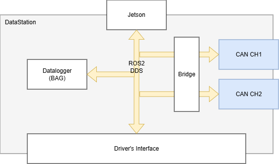

# LART DataStation w ROS2

Formula Student dashboard workspace for Raspberry Pi 5 + dual CAN (Waveshare 2-CH CAN HAT+).



## What does what 

- `lart_bringup`: launch + shared config (`car.launch.py`, `sim.launch.py`, `config/rpi_config.yaml`).
- `lart_msgs`: custom ROS 2 messages (`CanFrame`, `ButtonEvent`, `EncoderDelta`, `DashboardState`).
- `lart_bringup/can_bridge.py`: real car CAN reader (`can0/can1`) and ROS publisher.
- `sim/mock_can.py`: simulated vehicle values for home testing.
- `dashboard_ui`: pygame dashboard (old-style MVP interface).
- `input_handler`: GPIO buttons + encoders (`sim_mode` skips hardware).
- `led_controller`: WS2812 RPM bar (safe no-op on machines without NeoPixel libs).

## Data flow

- CAN CH1/CH2 -> `can_bridge` (car) or `mock_can` (home).
- Topics published: `/can/frames`, `/vehicle/rpm`, `/vehicle/dashboard_state`.
- `dashboard_ui` consumes dashboard state + inputs and renders UI.
- `led_controller` consumes RPM and drives LED strip.
- `input_handler` publishes `/input/buttons` and `/input/encoders`.

## Build

```bash
cd ~/GIT/lart_dashboard_ws
source ~/ros2_jazzy/install/local_setup.bash
pip install -r requirements.txt --break-system-packages
colcon build --symlink-install
source install/setup.bash
```

## Run simulation

```bash
source ~/ros2_jazzy/install/local_setup.bash
source ~/GIT/lart_dashboard_ws/install/setup.bash
ros2 launch lart_bringup sim.launch.py
```

## Run on the car (real CAN + GPIO + LEDs)

1) Bring CAN interfaces up:

```bash
sudo ip link set can0 up type can bitrate 1000000
sudo ip link set can1 up type can bitrate 1000000
```

2) Launch:

```bash
source ~/ros2_jazzy/install/local_setup.bash
source ~/GIT/lart_dashboard_ws/install/setup.bash
ros2 launch lart_bringup car.launch.py
```

## Configure for your car

// TODO (dbc2msg.py)